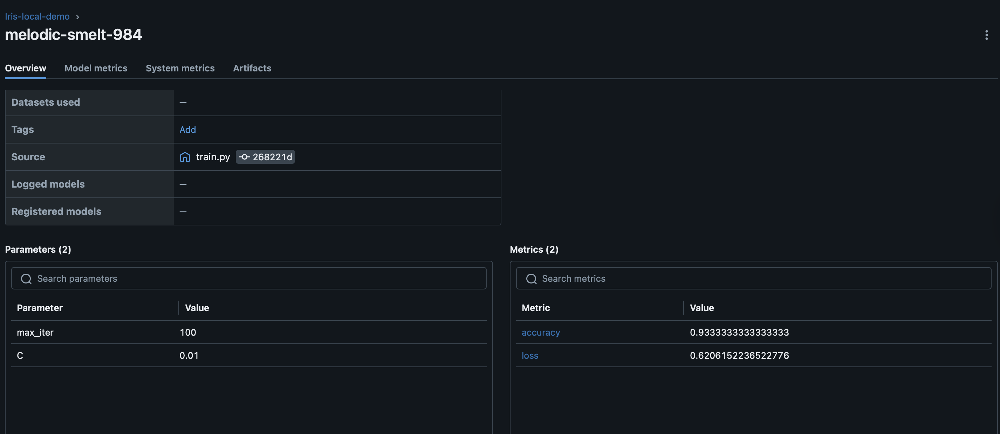
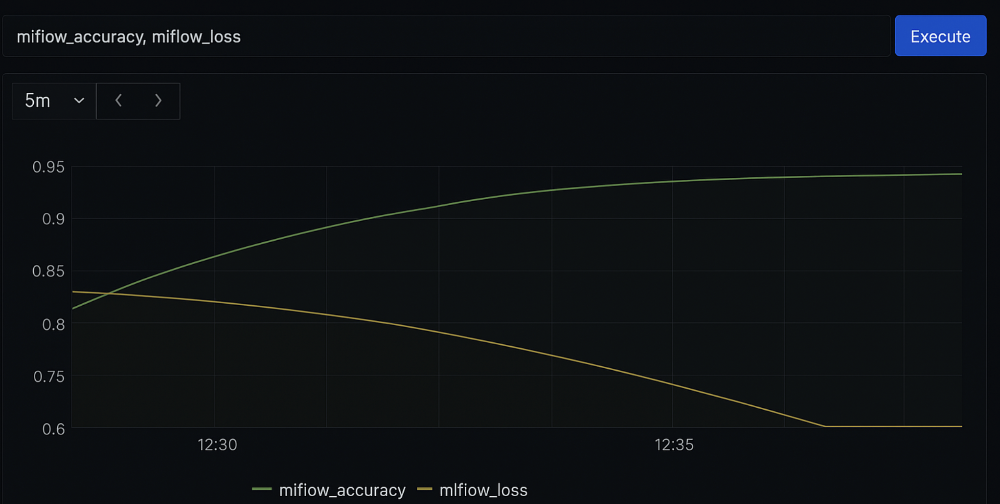

# Install
```bash
pip install -r requirements.txt
```

# Run
- Run ArgoCD
- Add yaml files from folder **application** to GitHub repo
- Run file **train.py** <br>
Еhe best model will be saved to the folder **best_model**

# Port-forward for local access
```bash
kubectl port-forward svc/mlflow 5500:5000 -n application
kubectl port-forward svc/pushgateway 9091:9091 -n application
```

# Viewing metrics in Grafana
Open Grafana at http://localhost:3000 <br>
Default login/password: admin/admin

# Demo




